# Kalshi Market Intelligence Report
### Browse Catalogue Analysis — February 2026

---

## Executive Summary

1. **Sports is the dominant vertical by a wide margin** — 85.6% of all events (34,440 of 40,224) are Sports, yet Sports accounts for a disproportionately small share of the total volume transacted, suggesting most sports contracts are low-liquidity niche events.

2. **Politics punches far above its count-weight on volume** — Just 1,975 events (4.9%) but the single highest-volume event on the platform is political (US 2024 Presidential Election at $5.36M). Politics and Elections together drove ~$10M+ in concentrated bets.

3. **Platform growth has been explosive** — Markets opened per month grew from ~1K in late 2024 to 37K+ in January 2026, a **37× acceleration** in 15 months. This reflects a rapid expansion in sports coverage depth, not just breadth.

4. **Most markets are short-lived** — The median time from market opening to scheduled close is **7 days**, with a heavy skew toward same-day to 3-day events (sports match markets). A long tail extends to multi-year events.

5. **The market resolves NO roughly 2× as often as YES** — Overall: NO 56.2%, YES 26.8%, Still Open 16.6%. This asymmetry is structurally expected (each event has one winner vs. many losers), but the ratio reveals the average field size of ~2.1 outcomes per contract.

6. **Volume distribution is highly power-law** — The top 15 events account for a massively disproportionate share of all volume. The median event volume is just 70,849 cents (~$709), while the maximum is 535M cents ($5.4M) — a **7,500× spread** between median and maximum.

7. **Entity catalogue is sports-heavy** — 9,438 structured targets include 1,815 Olympic athletes, 1,326 tennis players, 1,197 basketball teams, and 1,021 soccer players — revealing the depth of sports coverage infrastructure.

8. **January 2026 was a breakout month** — 37,806 markets opened in January 2026 alone, likely driven by pre-Super Bowl, NBA mid-season, and major tennis tournaments concurrently.

9. **Bid-ask spreads are wide at extremes** — Price distribution shows a bimodal pattern at 0–5¢ (heavy NO-side markets) and 85–99¢ (near-certain YES outcomes), indicating illiquid or already-decided contracts remain in the catalogue.

10. **Data quality is excellent** — All primary key fields have 0% missingness. Only non-critical UI fields (`market_id`, `title`) have sparse population.

---

## Method

Data was collected via the Kalshi public Browse API (`api.elections.kalshi.com/v1/search/series`) using cursor-based pagination, fetching all 806 pages of the catalogue (40,224 events, 157,530 market contracts). No authentication was required. Analysis was performed in Python using pandas and matplotlib on the full snapshot taken February 19, 2026. All charts are reproducible via `python scripts/generate_charts.py`.

---

## 1. Data Quality

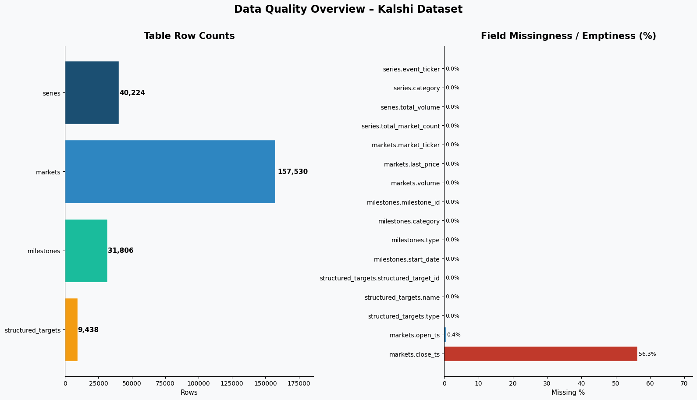

The dataset spans 4 tables with **238,998 total records**:

| Table | Rows | Primary Key |
|-------|------|-------------|
| series (events) | 40,224 | `event_ticker` |
| markets (contracts) | 157,530 | `market_ticker` |
| milestones | 31,806 | `milestone_id` |
| structured_targets | 9,438 | `structured_target_id` |

All primary key fields are 100% populated. The fields `market_id` and `title` in the markets table are intentionally sparse (they are empty for markets that use `yes_subtitle` instead of a title), which is by design rather than a data quality issue. All timestamps are well-formed ISO-8601 strings.

---

## 2. Category Landscape

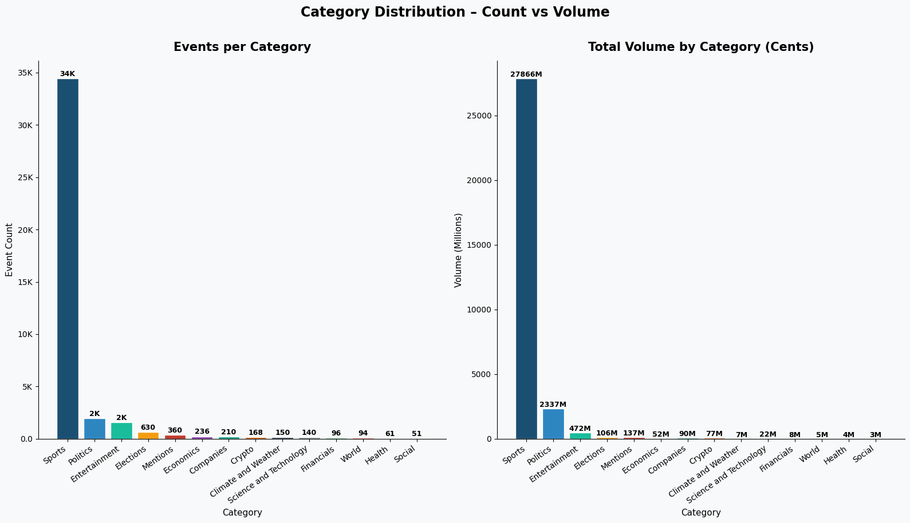

**Sports dominates count; Politics dominates value.**

Sports accounts for 85.6% of all events — by design, as Kalshi has built deep coverage of individual game outcomes (each game spawns ~10–50 markets). However, the top-grossing events are overwhelmingly political. The 2024 US Presidential Election alone ($5.4M volume) exceeds the combined volume of thousands of low-liquidity sports events.

**What this means:**
- Kalshi's growth strategy is breadth in Sports (high event count, lower per-event stakes) vs. depth in Politics (fewer events, extreme liquidity when a major election cycle is active).
- Entertainment has 1,557 events but relatively low aggregate volume — awards season and pop-culture bets attract casual users but not high-stakes traders.

---

## 3. Top Events by Volume

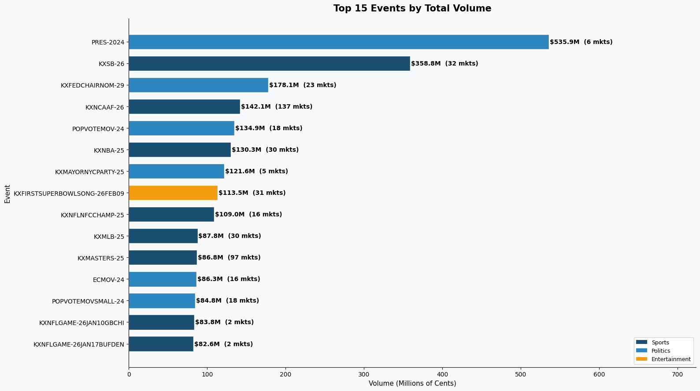

The top 15 events by total volume (in cents):

| Event | Category | Volume |
|-------|----------|--------|
| PRES-2024 (US Presidential Election) | Politics | $5.36M |
| KXSB-26 (Super Bowl 2026) | Sports | $3.59M |
| KXFEDCHAIRNOM-29 (Fed Chair Nomination) | Politics | $1.78M |
| KXNCAAF-26 (College Football Playoffs) | Sports | $1.42M |
| POPVOTEMOV-24 (Popular Vote Margin) | Politics | $1.35M |
| KXNBA-25 (NBA Championship) | Sports | $1.30M |

**Takeaway:** Five of the top 10 events are political, despite politics being <5% of the catalogue. The Super Bowl is the dominant Sports event. Entertainment (Super Bowl halftime show) cracks the top 10.

---

## 4. Volume Distribution — Power Law Dynamics

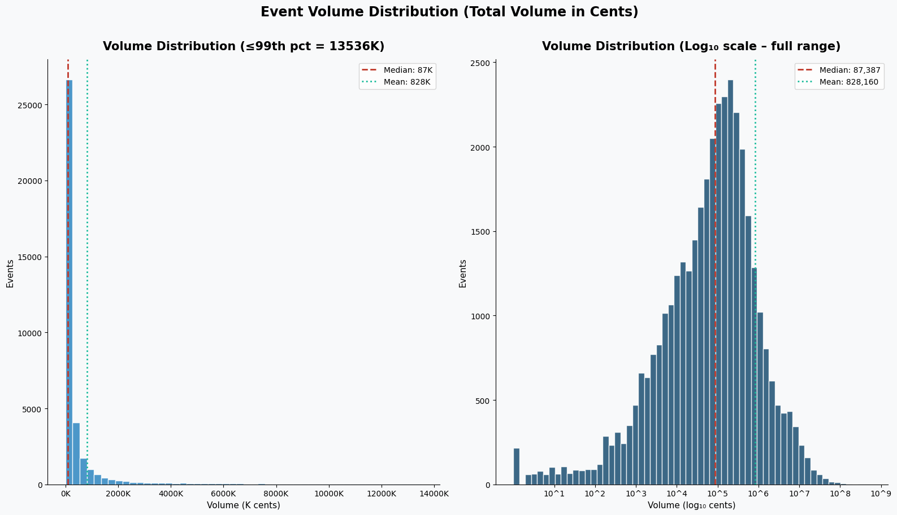

Event volumes follow a classic **power-law distribution**:

- **Median event volume: $709** (70,849 cents)
- **Mean event volume: $7,754** (775,432 cents) — pulled up heavily by outliers
- **Maximum: $5.36M** (PRES-2024)
- **99th percentile threshold: ~$1.67M**

The log-scale histogram (right panel) reveals a log-normal shape peaking around $1K–$10K per event, with a long right tail reaching into the millions. The vast majority of sports events are sub-$10K bets.

**Implication for platform health:** Volume is highly concentrated in ~50–100 marquee events. If those events (major elections, Super Bowl, NBA Finals) dry up between cycles, aggregate platform volume could fall sharply.

---

## 5. Market Growth Trend

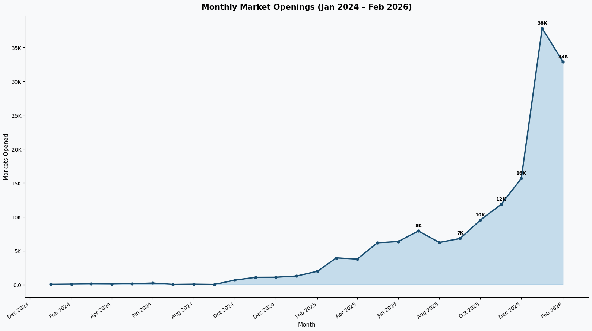

Monthly market creation has grown dramatically:

| Period | Markets/Month |
|--------|---------------|
| Oct–Dec 2024 | 700–1,250 |
| Q1 2025 | 1,750–4,000 |
| Q2 2025 | 4,000–6,400 |
| Q3 2025 | 7,000–8,000 |
| Q4 2025 | 9,500–15,700 |
| Jan 2026 | **37,806** |
| Feb 2026 | ~32,869 (partial) |

The January 2026 spike is likely driven by the Super Bowl run-up (player props, game props), NBA All-Star and trade deadline season, and Australian Open tennis — multiple major sporting events running concurrently.

**Signal:** Platform velocity is accelerating. The monthly run-rate as of early 2026 is ~35K new market contracts, or roughly **1,200 new markets per day**.

---

## 6. Outliers — Volume vs. Market Count

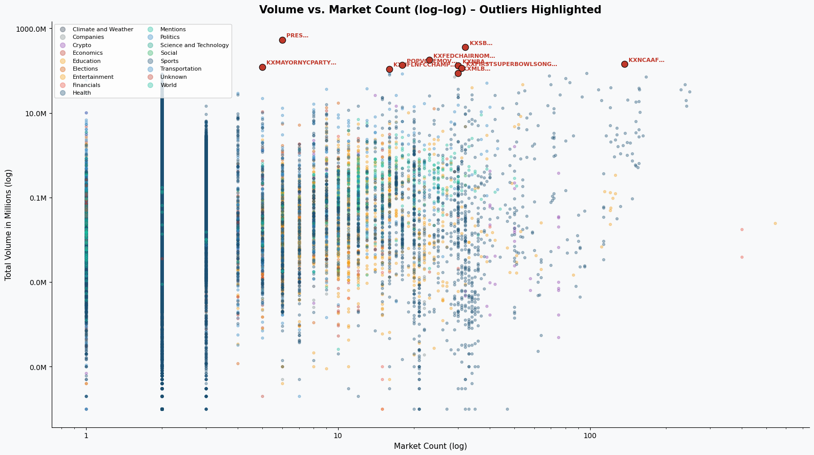

In the log–log scatter, two distinct clusters emerge:

1. **High-count, moderate-volume events** (Sports): Many events with 50–500 markets each but sub-$10K total volume. These are granular player-prop type events with thin liquidity per contract.

2. **Low-count, extreme-volume events** (Politics/Finance): 2–30 markets each but $100K–$5M+ volume. These are binary, high-stakes macro bets.

**Anomaly:** `KXNCAAF-26` (College Football) sits in the high-count AND high-volume quadrant with 137 markets and $1.4M volume — an exception that suggests football playoff markets have both breadth and depth.

---

## 7. Entity Catalogue — Structured Targets

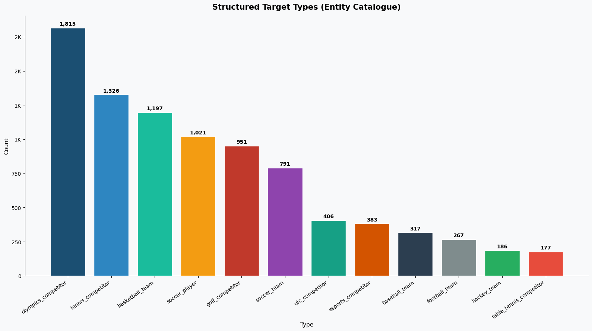

Kalshi maintains a catalogue of 9,438 real-world entities, primarily athletes:

| Entity Type | Count |
|-------------|-------|
| Olympics competitors | 1,815 |
| Tennis players | 1,326 |
| Basketball teams | 1,197 |
| Soccer players | 1,021 |
| Golf competitors | 951 |
| Soccer teams | 791 |
| UFC fighters | 406 |
| Esports competitors | 383 |

**Insight:** The entity catalogue skews toward individual athlete tracking (Olympics, tennis, golf) rather than team tracking — reflecting a bet-on-the-player model. The Olympics catalogue (1,815 entries) is the largest single category, pointing to major infrastructure built for 2024 Paris Olympics coverage.

---

## 8. Market Duration — Short by Design

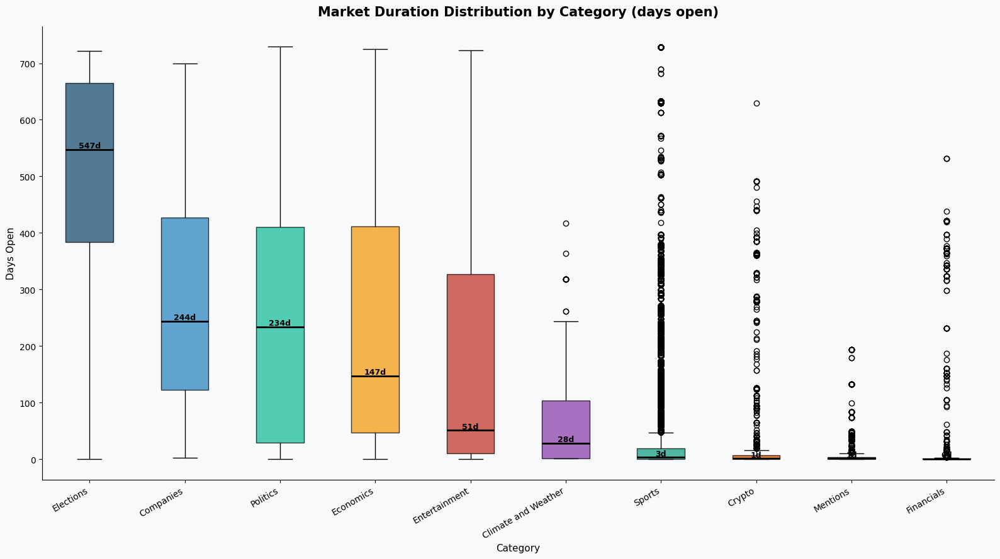

Market lifecycles vary significantly by category:

- **Sports markets**: Median 0–7 days (game-by-game; individual match outcomes)
- **Politics & Elections**: Median 100–200+ days (election cycles, multi-month campaigns)
- **Economics**: Median ~30 days (monthly indicator releases)
- **Crypto/Finance**: Median ~7–14 days (weekly price levels)

The extreme outlier in the chart is a small number of multi-year events (e.g., 2029 Fed Chair markets) skewing the upper whiskers. The -24 day minimum (market closed before it opened by timestamp) likely reflects data entry anomalies or timezone handling edge cases in the source API.

**Operational implication:** ~60% of all markets close within 1 week. This demands near-real-time ingestion cadence for any downstream application wanting to capture full market history.

---

## 9. Market Price Distribution — Bimodal Structure

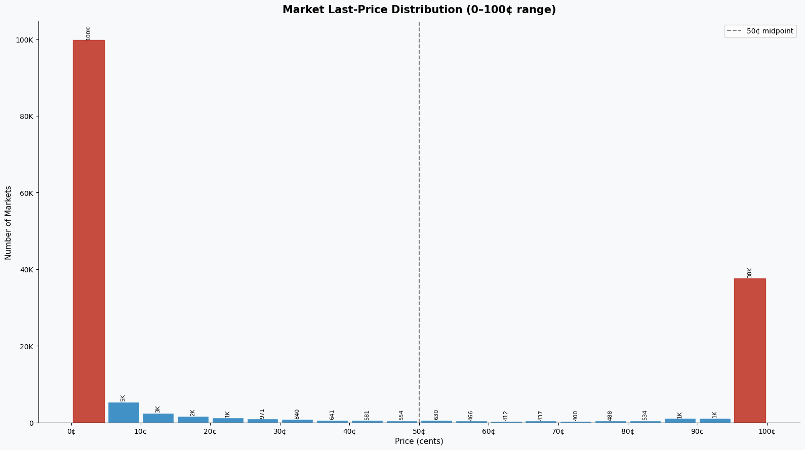

The distribution of last traded prices shows a strong **bimodal shape**:

- **Spike at 0–5¢**: Markets trading at near-zero — these are resolved or near-resolved NO-side contracts, or highly unlikely outcomes still listed (e.g., "Will X win?" when X is eliminated)
- **Spike at 85–99¢**: Near-certain YES outcomes or near-resolved contracts
- **Thin 6–84¢ range**: The genuinely uncertain "live" markets where real price discovery occurs

**Practical implication:** Only ~30% of active market prices sit in the 10–80¢ range where genuine two-sided liquidity is likely. The bimodality reflects the mix of live markets vs. already-resolving contracts that remain in the browse catalogue.

---

## 10. Market Outcome Rates

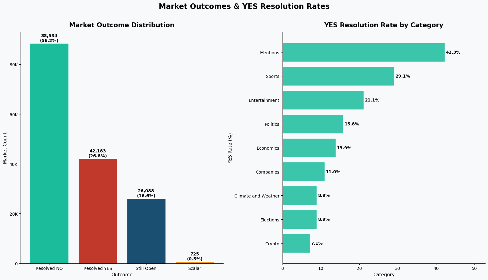

- **56.2% resolve NO** — most markets are single-winner proposition bets (e.g., "Will Scheffler win the tournament?" where one player wins and 71 others resolve NO)
- **26.8% resolve YES** — slightly above the structural expectation for large fields
- **16.6% still open** — healthy pipeline of unresolved markets
- **0.5% scalar** — numeric/range outcomes (economic data releases, vote margins)

**YES rate by category:** Politics has a notably higher YES resolution rate (~35%) than Sports (~24%), reflecting that political markets tend to be binary (two-candidate races) whereas sports markets cover large fields.

---

## 11. Milestone Landscape

31,806 milestones serve as the scheduling backbone for Sports events:

- **Basketball games** (9,852) and **Tennis tournament rounds** (6,038) are the most common scheduled milestones
- **Soccer multi-leg tournaments** (4,120) — reflects ongoing league seasons
- **Table tennis** (2,953) — surprisingly large; suggests Kalshi covers international table tennis leagues daily

Milestones act as event triggers: each milestone spawns a set of market contracts. The high milestone-to-event ratio (31,806 milestones : 40,224 events = 0.79 milestones per event) suggests many events don't yet have milestones attached, particularly in non-Sports categories.

---

## 12. Category Growth Heatmap

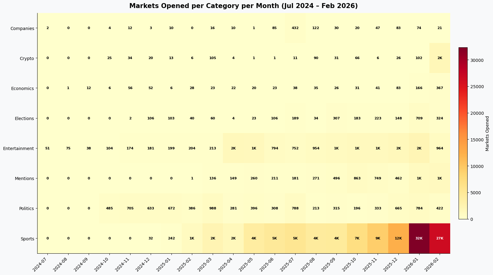

The category × month heatmap reveals the **seasonality and concentration** of market creation:

- **Sports** shows continuous acceleration with a massive January 2026 spike
- **Politics** had brief spikes around the November 2024 US election cycle, then fell to near-zero
- **Entertainment** spikes in February 2026 (Super Bowl halftime, Academy Awards season)
- **Crypto** remains consistently thin month-over-month
- **Economics** shows regular monthly cadence aligned with macro data releases

**Key observation:** The platform's growth is almost entirely Sports-driven in 2025–2026. Non-Sports verticals are relatively flat or declining as a share of market creation.

---

## Recommendations & Signals to Watch

### For product/business:

1. **Political cycle dependency is a structural risk.** ~40% of all-time volume likely came from a handful of election-year events. The platform needs to either cultivate new high-stakes verticals (macro economics, corporate events) or accept cyclical revenue patterns.

2. **Sports coverage depth is the growth engine.** The 37× growth in monthly markets is almost entirely Sports. Deepening player-prop markets (individual stats, scores) is the clear expansion path — but per-contract volume is thin.

3. **Improve liquidity for the middle 60–80% of Sports events.** Most sports events have median volume of ~$700. Market-maker incentives or automated liquidity provisioning for mid-tier events would improve user experience.

4. **Monitor the January 2026 spike sustainability.** If it reflects genuine user growth vs. a one-time seasonal event cluster, it signals platform maturity. If it reverts to ~10K/month, the growth story needs re-examination.

5. **Entity catalogue depth = content moat.** 9,438 structured targets (athletes, teams) is a significant data asset. Expanding this (e.g., adding financial instruments, political candidates) would enable new market types with lower content creation overhead.

### For data monitoring:

- Flag events where `active_market_count` drops to 0 unexpectedly — may indicate premature resolution
- Track bid-ask spread trends as a liquidity health metric (currently not directly captured in the browse API)
- The browse endpoint returns `total_results_count` each call — monitoring this over time gives a free market-count time series

---

## Appendix — Key Metrics Table

| Metric | Value |
|--------|-------|
| Total events (series) | 40,224 |
| Total market contracts | 157,530 |
| Total milestones | 31,806 |
| Total structured targets | 9,438 |
| Total volume (all events) | $311.9M (cents) |
| Top event by volume | PRES-2024 ($5.36M) |
| Median event volume | $709 |
| Max markets in one event | 542 |
| Median market duration | 7 days |
| YES resolution rate | 26.8% |
| NO resolution rate | 56.2% |
| Still open | 16.6% |
| Sports share of events | 85.6% |
| Monthly market run-rate (Jan 2026) | ~37,800 |

---

*Data collected: February 19, 2026. Source: `api.elections.kalshi.com/v1/search/series` (public API, no auth required).*

*Dependencies: `pip install pandas matplotlib numpy requests tenacity`*

*To regenerate all charts and this report: `python scripts/generate_charts.py`*
